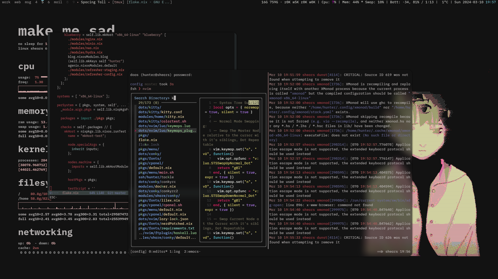

# DOTFILES

Perpetual WIP.

## Where the stuff is

- packages (fonts, scripts, fish plugins, some programs) are available as either an overlay or in the `packages` attribute.
- some useful modules are available in `modules/share/`. No documentation for those though.
- the dotfiles are mostly in `dots`. You can probably get them with the `home` module.

## Highlights

- **alloy** - framework for nix-module-centric inter-host data exchange.
- **facts** - scripts for collecting and building facts about hosts.
- **term-farm** - mostly declarative non-NixOS virtual machines, a DIY cloud.
- **wg** - declarative wireguard setup.
- **lilex** - lilex font packaged and patched, to allow building nerd font from
  sources on any nix machine - select all your favourite ligatures.
- **xmonad** - xmonad.
