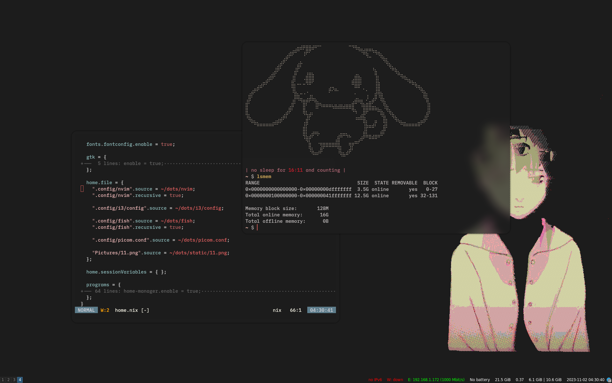

# DOTFILES

WIP.

### Highlights

- **mainmenu** - like rofi but hip and dmenu, with quick access to programs, configs and math stuff
- **lilex** - lilex font packaged and patched, to allow building nerd font from sources on any nix machine - select all your favourite ligatures.

### TODO
- nice screenshots for the readme
- add `training wheels` switch to neovim
- i3/sway toggle
